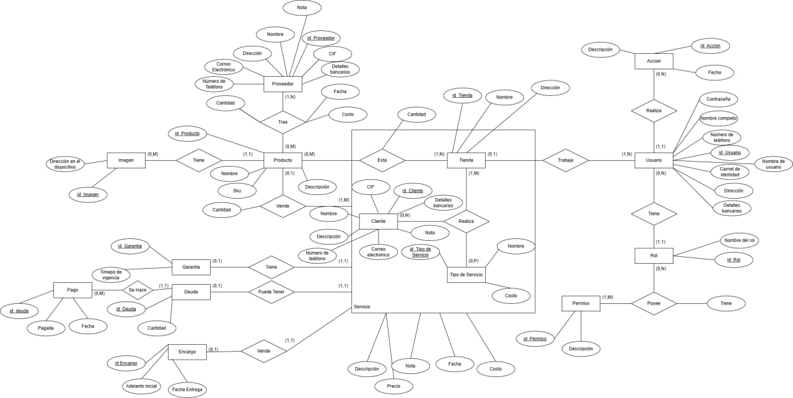

# 🚀 My-Store-Management Backend

## 📌 Project Overview
RESTful API for store management system with:
- JWT Authentication
- Role-based Access Control
- Inventory Management
- Sales Tracking

## 🛠️ Tech Stack
- **Runtime**: Node.js 20.x
- **Framework**: Express 4.x
- **ORM**: TypeORM 0.3.x
- **Database**: PostgreSQL 16.x
- **Auth**: JWT

>## 🌐 Some API Endpoints Of User
>POST /Usuario/auth - User authentication
>POST /Usuario/change/pass - Change password (authenticated)
>GET /Usuario - Get all users (authenticated)
>GET /Usuario/:ID - Get user by ID (authenticated)
>POST /Usuario/createUsuario - Create new user (authenticated)
>PUT /Usuario/updateUsuario/:ID - Update user (authenticated)
>DELETE /Usuario/deleteUsuario/:ID - Delete user (authenticated)
>POST /Usuario/api/filtrar - Filter users (authenticated)
>POST /Usuario/ordenar/all - Sort users (authenticated)
>GET /Usuario/tiene_permiso/:id_usuario/:id_permiso - Check if user has permission

## 🗄️ Entity Relationship Diagram of the Database

## 📚 Additional Documentation
### Business Diagram

### Object Diagram

### Flow Diagram of Sell

>## 💻 Local Installation
>1- Cree una base de datos bacía con posgresSQL con un nombre de su preferencia (por ejemplo >"My-Store-Management-DB")
>2- Localice el archivo "DB_backup.sql" y restaure la base de datos recien creada con este archivo
>3- Ejecute en la raiz del proyecto "npm install" o "yarn install" si prefiere para instalar dependencias
>4- Cree en la raiz del proyecto un archivo ".env" con la siguiente estructura:
>DB_HOST=localhost #URL de la base de datos
>DB_PORT=5432 #Puerto de la base de datos
>DB_USERNAME=posgres #Nombre de su usuario en su postgres
>DB_PASSWORD=password #Su contraseña de postgres 
>DB_NAME=My-Store-Management-DB #Nombre que halla definido al crear la base de datos
>5- Abra una consola en la ubicación de la raiz del proyecto y ejecute el comando "npm start" para iniciar el servidor
>6- Si siguió los pasos el servidor deve correr en el puerto 4000
>7- Puede obtener un token de autentificación haciendo una solicitud HTTP a 
>POST http://localhost:4000/Usuario/auth
>body: {nombre_usuario: administradorGeneral, contrasenna: 123456}
