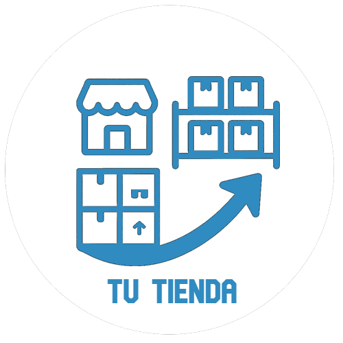

# 🚀 My-Store-Management




> ## Project Description  
> This is a website created for the management of stores, users, projects, suppliers, customers, inputs, outputs, movements, sales, debts and more products of a company or small business.

>## 🌟 Demo en Vivo
>[](https://tudominio.com)  
>### Accede con las siguientes credenciales:
>Administrador general: 
>  USER: administradorGeneral
>  CONT: 123456
>

## 📌 Características Principales
- ✅ **Interactividad**: Filtros de productos, ventas, entradas en tiempo real
- ✅ **Diseño Responsivo**: Compatible con móviles, tablets y desktop
- ✅ **Funcionalidad**: Gestión en tiempo real de todo lo relacionado con productos de su negocio

## 🛠️ Tecnologías Usadas
| Frontend               | Backend              | Herramientas          |
|------------------------|----------------------|-----------------------|
|  |  |  |
|  |  |  |
|  |  |  |


## 🖼️ Capturas de Pantalla
| Desktop | Mobile |
|---------|--------|
|  |  |

## 🚀 Cómo Empezar

### Requisitos Previos Para Correr el Software de Forma Local
- Node.js v16+
- NPM/Yarn
- Navegador moderno (Chrome, Firefox, Edge)
- PostgresSQL v16+

### Instalación
> Para Instalar este proyecto de froma local dirijase a las ramas de frontend y backend respectivamente y siga las instrucciones
>FrontEnd: [](https://tudominio.com) 
>BackEnd: [](https://tudominio.com) 

### Instalación
```bash
# Clonar repositorio
git clone https://github.com/tu-usuario/tu-repo.git

# Instalar dependencias
npm install

# Iniciar servidor de desarrollo
npm run dev
